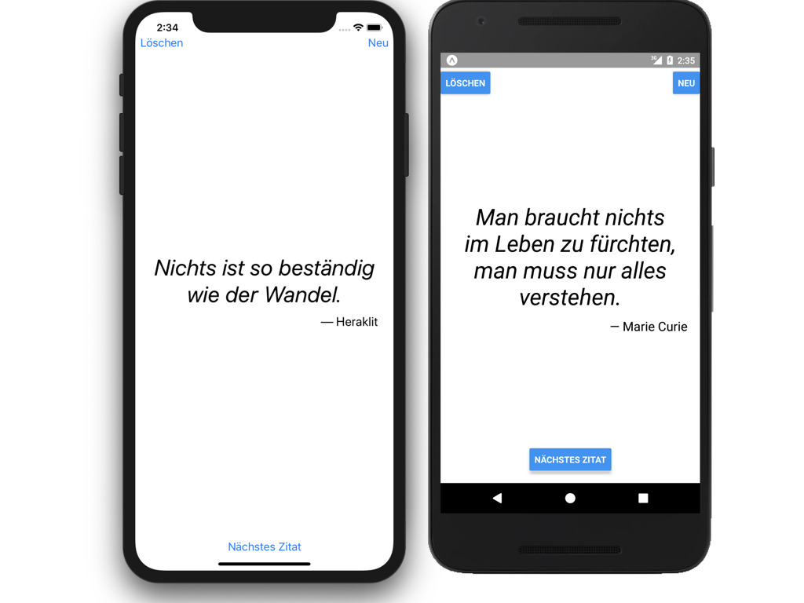

# NiceQuotes

Beispiel-App im [Video-Kurs zu React Native](https://www.udemy.com/react-native-einstieg/)

1. Projekt clonen oder herunterladen: `git clone https://github.com/behrends/NiceQuotes.git`
1. Ins Projektverzeichnis wechseln: `cd NiceQuotes`
1. npm-Packages für das Projekt installieren: `npm install`
1. Einstellungen für Firebase in `js/Firebase.js` eintragen (`apiKey` etc.):

```
const config = {
  // TODO: passende Werte für Firebase-config hier eintragen
  apiKey: 'APIKEY',
  authDomain: 'AUTHDOMAIN',
  databaseURL: 'DATABASEBURL',
  projectId: 'PROJECTID',
  storageBucket: 'STORAGEBUCKET',
  messagingSenderId: 'MESSAGINGSENDERID'
};
```

Du findest diese Daten im Überblick deines Firebase-Projekts wie hier beschrieben: https://firebase.google.com/docs/guides/ (Abschnitte „getting started“).

- React Native Packager starten mit `expo start`

**Achtung: die App funktioniert nur, wenn die Einstellungen für Firebase eingetragen wurden!**


